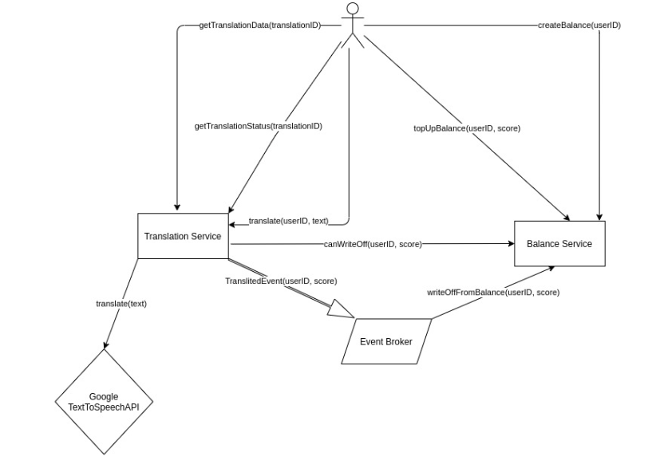

# Приложение для перевода текста в речь
Text to speech: пользователь заводит аккаунт, загоняет текст, через какое-то время получает mp3 своего текста.

### Запуск
```
docker-composer up
```

### Архитектура


### Тестирование
Инициализация
- Открыть postman
- Импортировать переменные окружения из `./apitests/src/environments/tts.postman_environment.json`
- Импортировать шаблоны запросов из `./apitests/src/tts.postman_collection.json`